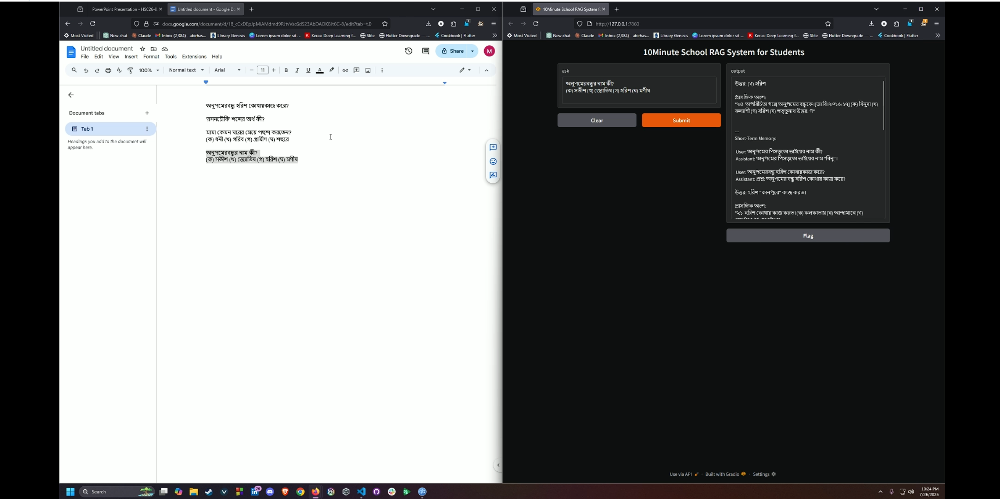

## Overall Used Libraries / Technologies


---

## Detailed Design Decisions

### Text Extraction

The primary library used is **PyMuPDF**, with a fallback to **PyPDF2**.

- **PyMuPDF** is chosen because of its excellent support for **Unicode and multilingual text**, which is critical for processing Bengali-language documents.
- If PyMuPDF fails, the system falls back to **PyPDF2**, which offers a basic but reliable method for PDF parsing.
- The given pdf seems to have a legacy encoder going on, was change to unicode to mordernize and to get the best output from the RAG.

---

### Chunking Strategy

This system uses a **sentence-based, fixed word-count chunking** approach with overlap.

**Why this approach is effective for semantic retrieval:**

1. **Sentence-level chunking** ensures each chunk contains a complete thought or unit of meaning.
2. It avoids breaking sentences in the middle, which can lead to loss of context.
3. **Overlap between chunks** helps maintain continuity and improves retrieval accuracy.

**Parameters used:**

- Chunk size: 300 words  
- Overlap: 150 words

This strategy is more effective than arbitrary character or word splits, especially when dealing with natural language in Bengali and English.

### embedding model `intfloat/multilingual-e5-large`

The E5 family of models (Embedding for Embedding-based retrieval, from Microsoft/Intfloat) are specifically designed and fine-tuned for semantic search and retrieval-augmented generation (RAG) tasks. Also E5 models are instruction-tuned meaning they are trained to produce embeddings that are directly comparable for queries and documents, making them ideal for question-answering and RAG.

**How does it capture the meaning of the text?**

Simply, dense vector encodes full semantic meaning via transformer self-attention and cross-lingual training.

### How am I comparing the query with your stored chunks?

I am using vector similarity search with the following steps:
- Embedding using `intfloat/multilingual-e5-large`
- Normalization (L2-normalized)
- Similarity Search (using FAISS) : The query embedding is compared to all stored chunk embeddings using inner product (which, after normalization, is equivalent to cosine similarity).
The top-k most similar chunks (highest similarity scores) are retrieved as relevant context.

### Why did I choose this similarity method and storage setup?
- Cosine similarity is the standard for comparing semantic embeddings, as it measures the angle (semantic closeness) between vectors, not their magnitude.
- This approach is standard for semantic retrieval because it is fast, accurate, and robust for finding meaningfully related text, and FAISS is a proven solution for efficient vector storage and search.

### How do I ensure that the question and the document chunks are compared meaningfully? 
By
- Semantic Embeddings with a Multilingual Model.
- Instruction Tuning and Prefixes.
- Chunking Strategy & Cosine Similarity Search.

**What would happen if the query is vague or missing context?**
- If the query is vague (e.g., "Tell me more" or "What about that?"), its embedding may not be close to any specific chunk, resulting in low similarity scores for all retrieved chunks.
- LLM May Not Find an Answer.

### Do the results seem relevant? If not, what might improve them (e.g. better chunking, better embedding model, larger document)?
I fought this irrevelancy problem with :
- Sentence-based, fixed word-count with overlap.
- Used a better embedding model called `intfloat/multilingual-e5-large`.
- Used top of the line LLM for generation `GPT-4.1`.

# Setup guide

```bash
# ========================================
# Multilingual RAG QA System Setup Guide
# ========================================

# 1. Clone the project repository
git clone git@github.com:chlorineCtrl/10min_RAG.git
cd 10min_RAG.git

# 2. Create and activate a virtual environment

# For Unix/macOS:
python3 -m venv venv
source venv/bin/activate

# For Windows (CMD):
python -m venv venv
venv\Scripts\activate

# 3. Upgrade pip and install all dependencies
pip install --upgrade pip
pip install -r requirements.txt

# 4. Set up environment variables

# Create a .env file with the following content:
(this token is sensetive in a public repo so I hide it using .gitignore, I have provided this token in "Source code (on GitHub Public Repo) & README file" section of the google form)
echo "GITHUB_TOKEN=your_azure_inference_token_here" > .env


# 6. Run the RAG application
python main.py

# This will:
# - Extract text from the PDF
# - Chunk and embed the content
# - Launch a Gradio interface for Q&A

# 7. Open Gradio in your browser
# Visit http://localhost:7860 or the printed URL
```

### Sample queries and outputs
By opening gradio in a browser (as instructed in the setup portion above) you can test the model :
1. It accepts user queries and generates answers in a simple UI based on the retrieved information:
- 
2. It maintains Long-Short term memory :
- 


# Here is a short Demo :
[](https://drive.google.com/file/d/1nbepPWfvm-OJdOxvszwSTqHGXA_CaY0B/view?usp=sharing)

